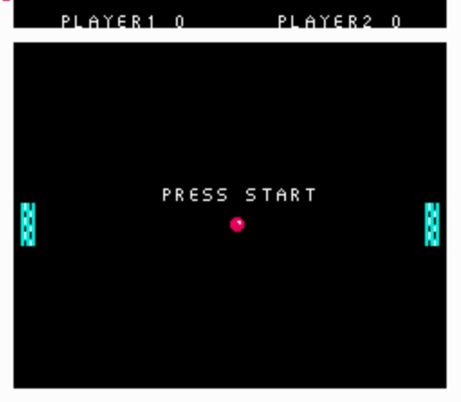

# NES Pong Game

### Introduction

Simple pong game written in 6502 assembly for the NES. This project is meant to be a starting point for anyone wishing to learn NES game development in a clean way. What most tutorials lack is project organization. It's great to learn how to do some advanced topic, but when implemented in a somewhat big game people tend to get lost really quick.

### Installation

The following instructions assume that you are using a linux based operating system. I plan to switch to a cmake build for better compatibility. Till then, the only thing you have to do is run the mk.sh script. The compiled rom will be created in main directory. For the build process to work you need to have installed cc65 package and python3. As an emulator i recommend using FCEUXD because of the development tools that it have and it works great using wine under linux. Python is used for generating for converting dbg file generated by the compiler to a format that can be used in FCEUXD for symbolic debugging.
